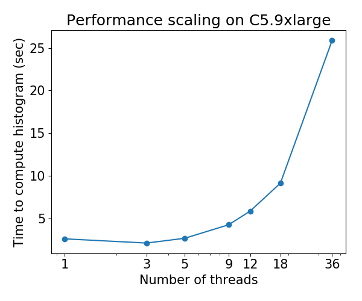

The `hist` method of XGBoost scales poorly on multi-core CPUs: a demo script
============================================================================

Currently, the `hist` tree-growing algorithm (`tree_method=hist`) of [XGBoost](https://github.com/dmlc/xgboost)
scales poorly on multi-core CPUs: for some datasets, performance deteriorates as the number of threads is increased.
This issue was discovered by [@Laurae2](https://github.com/Laurae2)'s
[Gradient Boosting Benchmark](https://sites.google.com/view/lauraepp/new-benchmarks).

To make things easier for contributors, I went ahead and isolated the performance bottleneck. A vast majority of time (> 95 %)
is spent in a stage known as **gradient histogram construction**. This repository isolates this stage so that it is easy to
fix and improve.

# How to compile and run
1. Compile the script by running CMake:
```bash
mkdir build
cd build
cmake ..
make
```

2. Download [record.tar.bz2](https://s3-us-west-2.amazonaws.com/xgboost-examples/xgboost-fast-hist-perf-lab-record.tar.bz2) in the same directory.
3. Extract record.tar.bz2 by running `tar xvf record.tar.bz2`.
4. Run the script:
```bash
# Usage: ./perflab record/ [number of threads]
./perflab record/ 36
```

Running with different number of threads should produce the following trend of performance:


# What this script does
The script reads from record.tar.bz2, which was processed from the [Bosch dataset](https://www.kaggle.com/c/bosch-production-line-performance/data).
Its job is to compute histograms for gradient pairs, where each bin of histogram is a partial sum.

Some background:
* A **gradient** for a given instance `(X_i, y_i)` is a pair of `double` values that quantify the distance between the true label `y_i` and predicted label `yhat_i`.
* There are as many gradient pairs as there are instances in a training dataset.
* In order to find optimal splits for decision trees, we compute a **histogram** of gradients. Each bin of the histogram stands for a range of feature values. The value of the bin is given by the sum of gradients corresponding to the data points lying inside the range.
* In each boosting iteration, we have to compute multiple histograms, each histogram corresponding to a set of instances.

# Setting build types

* By default, 'Release' build type will be used, with flags `-O3 -DNDEBUG`.

* For perfiling, you may want to add debug symbols by choosing 'RelWithDebInfo' build type instead:
  ```bash
  cmake -DCMAKE_BUILD_TYPE=RelWithDebInfo ..
  ```
  This build type uses the following flags: `-O2 -g -DNDEBUG`.

* For full control over the compilation flags, specify `CMAKE_CXX_FLAGS_RELEASE`:
  ```bash
  cmake -DCMAKE_CXX_FLAGS_RELEASE="-Ofast -DNDEBUG -march=native -mtune=native" ..
  ```
  This give you full control over the optimization flags. Here, we are compiling with `-Ofast -DNDEBUG -march=native -mtune=native` flags.

  You can check whether they are applied using `make VERBOSE=1` and looking at the C++ compilation lines for the existence of the flags you used:

  ```bash
  /usr/bin/c++   -I/home/ubuntu/xgboost-fast-hist-perf-lab/include  -Ofast -DNDEBUG -march=native -mtune=native
      -fopenmp -std=gnu++11 -o CMakeFiles/perflab.dir/src/main.cc.o
      -c /home/ubuntu/xgboost-fast-hist-perf-lab/src/main.cc
  ```
